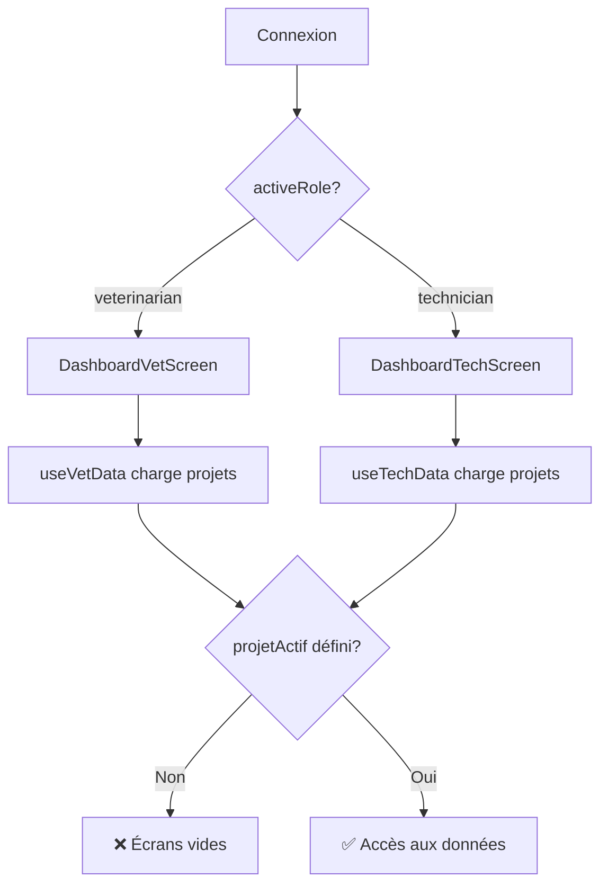
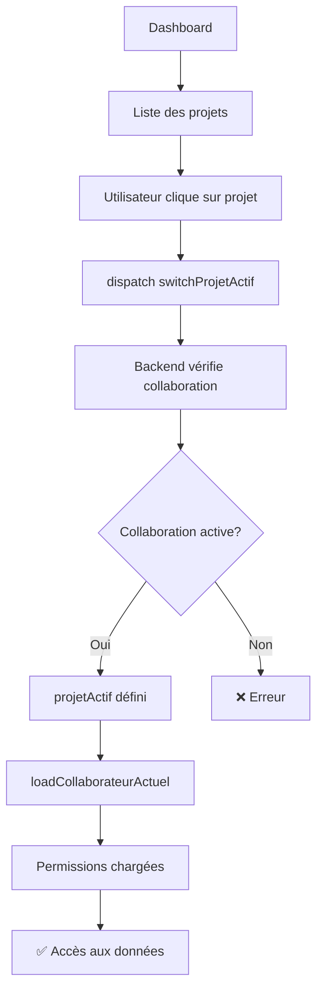

# Analyse Complète : Accès des Vétérinaires et Techniciens aux Données des Producteurs

**Date d'analyse** : 2026-01-21  
**Version** : 1.0  
**Auteur** : Analyse Automatique du Codebase

---

## Table des Matières

1. [Vue d'Ensemble](#vue-densemble)
2. [Architecture du Système](#architecture-du-système)
3. [Flux de Navigation Détaillés](#flux-de-navigation-détaillés)
4. [Inventaire des Écrans](#inventaire-des-écrans)
5. [Système de Permissions](#système-de-permissions)
6. [Gestion des Projets](#gestion-des-projets)
7. [Problématiques Identifiées](#problématiques-identifiées)
8. [Recommandations](#recommandations)
9. [Diagrammes](#diagrammes)

---

## 1. Vue d'Ensemble

### 1.1 Contexte

Les **Vétérinaires** et **Techniciens** sont des profils collaboratifs qui peuvent être invités par des **Producteurs** à accéder aux données de leurs projets (fermes). Contrairement aux Producteurs qui possèdent leurs projets, les Vétérinaires/Techniciens accèdent aux données via des **collaborations** avec des permissions granulaires.

### 1.2 Points Clés

- ✅ **Système de permissions granulaires** : Chaque collaboration définit des permissions spécifiques (reproduction, nutrition, santé, etc.)
- ✅ **Multi-projets** : Un vétérinaire/technicien peut travailler avec plusieurs producteurs
- ⚠️ **Pas de sélection explicite de projet** : Le système utilise un "projet actif" (`projetActif`) mais il n'y a pas d'interface claire pour le sélectionner
- ⚠️ **Dépendance au projet actif** : La plupart des écrans nécessitent un `projetActif` mais il n'est pas toujours défini pour les vétérinaires/techniciens

---

## 2. Architecture du Système

### 2.1 Stack Technique

- **Frontend** : React Native + TypeScript
- **State Management** : Redux Toolkit
- **Navigation** : React Navigation (Tab Navigator + Stack Navigator)
- **Backend** : NestJS + PostgreSQL
- **Authentification** : JWT

### 2.2 Structure des Données

#### Collaboration
```typescript
interface Collaborateur {
  id: string;
  user_id: string;
  projet_id: string;
  role: 'veterinaire' | 'technicien' | 'gestionnaire' | 'ouvrier' | 'observateur';
  statut: 'actif' | 'en_attente' | 'rejete' | 'expire';
  permissions: {
    reproduction: boolean;
    nutrition: boolean;
    planification: boolean;
    mortalites: boolean;
    finance: boolean;
    rapports: boolean;
    sante: boolean;
  };
  date_creation: string;
  date_acceptation?: string;
  expiration_date?: string;
}
```

#### Projet Actif
```typescript
interface Projet {
  id: string;
  nom: string;
  proprietaire_id: string; // ID du producteur propriétaire
  type: string;
  statut: 'actif' | 'archive';
  // ... autres champs
}
```

### 2.3 Flux de Données

```
┌─────────────────┐
│  Connexion      │
│  (JWT Token)    │
└────────┬────────┘
         │
         ▼
┌─────────────────┐
│  RoleContext    │
│  (activeRole)   │
└────────┬────────┘
         │
         ▼
┌─────────────────┐
│  useVetData /   │
│  useTechData    │
│  (charge projets│
│   accessibles)  │
└────────┬────────┘
         │
         ▼
┌─────────────────┐
│  Redux Store    │
│  - projetActif  │
│  - collaborateur│
│    Actuel       │
└────────┬────────┘
         │
         ▼
┌─────────────────┐
│  Écrans         │
│  (Dashboard,    │
│   Santé, etc.)  │
└─────────────────┘
```

---

## 3. Flux de Navigation Détaillés

### 3.1 Scénario 1 : Vétérinaire consulte les animaux malades

```
1. Connexion
   └─> AppNavigator détecte activeRole = 'veterinarian'
       └─> Redirige vers 'Main' (Tab Navigator)
           └─> Affiche DashboardVetScreen

2. Dashboard Vétérinaire
   └─> useVetData() charge :
       - Liste des projets accessibles (via /collaborations/invitations)
       - Consultations du jour
       - Alertes sanitaires
       └─> Affiche "Mes fermes" (clientFarms)

3. Sélection du projet ❌ PROBLÈME
   └─> PAS D'INTERFACE EXPLICITE pour sélectionner un projet
       └─> Le système utilise projetActif mais :
           - projetActif est NULL pour les vétérinaires/techniciens
           - Il n'y a pas de mécanisme pour le définir

4. Navigation vers Santé
   └─> Tab "Santé" visible si hasPermission('sante') = true
       └─> SanteScreen vérifie projetActif
           └─> Si NULL : Affiche "Aucun projet actif" ❌

5. Consultation des détails
   └─> Impossible si projetActif est NULL
```

**Problème identifié** : Les vétérinaires/techniciens ne peuvent pas accéder aux données car `projetActif` n'est jamais défini.

### 3.2 Scénario 2 : Technicien génère un rapport de performances

```
1. Connexion
   └─> AppNavigator détecte activeRole = 'technician'
       └─> Redirige vers DashboardTechScreen

2. Dashboard Technicien
   └─> useTechData() charge :
       - Liste des fermes assistées (assistedFarms)
       - Tâches du jour
       - Enregistrements récents

3. Navigation vers Rapports
   └─> Tab "Rapports" visible si hasPermission('rapports') = true
       └─> ReportsScreen vérifie projetActif
           └─> ReportsHub nécessite projetActif.id
               └─> Si NULL : Erreur ou données vides ❌
```

**Problème identifié** : Même problème - `projetActif` n'est pas défini.

### 3.3 Scénario 3 : Vétérinaire consulte les données de reproduction

```
1. Connexion → Dashboard Vétérinaire

2. Navigation vers Reproduction
   └─> Tab "Reprod." visible si hasPermission('reproduction') = true
       └─> ReproductionScreen (ProtectedScreen)
           └─> Vérifie collaborateurActuel.permissions.reproduction
               └─> Si true : Affiche ReproductionScreenContent
                   └─> GestationsListComponent nécessite projetActif
                       └─> Si NULL : Pas de données ❌
```

**Problème identifié** : Les composants de reproduction filtrent par `projetActif.id` qui est NULL.

---

## 4. Inventaire des Écrans

### 4.1 Écrans Principaux

#### Écran : Dashboard Vétérinaire
- **Fichier** : `src/screens/DashboardVetScreen.tsx`
- **Route** : `SCREENS.DASHBOARD_VET` (Tab Navigator)
- **Accessible par** : ☑ Vétérinaire uniquement
- **Permissions requises** : Aucune (écran principal)
- **Composants clés** :
  - `useVetData()` : Charge les projets accessibles
  - `DashboardHeader` : En-tête avec photo de profil
  - Liste des "Mes fermes" (clientFarms)
  - Consultations du jour
  - Alertes sanitaires
- **Description** : 
  - Affiche la liste des fermes où le vétérinaire est collaborateur
  - Montre les consultations du jour et à venir
  - Affiche les alertes sanitaires
  - **PROBLÈME** : Les fermes sont affichées mais non cliquables pour sélectionner un projet

#### Écran : Dashboard Technicien
- **Fichier** : `src/screens/DashboardTechScreen.tsx`
- **Route** : `SCREENS.DASHBOARD_TECH` (Tab Navigator)
- **Accessible par** : ☑ Technicien uniquement
- **Permissions requises** : Aucune
- **Composants clés** :
  - `useTechData()` : Charge les fermes assistées
  - Liste des "Mes fermes" (assistedFarms)
  - Tâches du jour
  - Enregistrements récents
- **Description** :
  - Affiche la liste des fermes où le technicien est collaborateur
  - Montre les tâches planifiées
  - **PROBLÈME** : Même problème - pas de sélection de projet

#### Écran : Santé
- **Fichier** : `src/screens/SanteScreen.tsx`
- **Route** : `SCREENS.SANTE` (Tab Navigator, caché de la barre)
- **Accessible par** : ☑ Vétérinaire ☑ Technicien (si permission `sante`)
- **Permissions requises** : `sante` (via `collaborateurActuel.permissions.sante`)
- **Composants clés** :
  - `useSanteLogic()` : Logique métier
  - `SanteHeader` : En-tête avec badges d'alertes
  - `SanteTabs` : Onglets (Vaccinations, Maladies, Traitements, etc.)
  - `SanteContent` : Contenu selon l'onglet
- **Description** :
  - Gestion complète de la santé du cheptel
  - **PROBLÈME** : Vérifie `projetActif` et affiche "Aucun projet actif" si NULL

#### Écran : Reproduction
- **Fichier** : `src/screens/ReproductionScreen.tsx`
- **Route** : `SCREENS.REPRODUCTION` (Tab Navigator, visible si permission)
- **Accessible par** : ☑ Vétérinaire ☑ Technicien (si permission `reproduction`)
- **Permissions requises** : `reproduction` (via `collaborateurActuel.permissions.reproduction`)
- **Composants clés** :
  - `ProtectedScreen` : Vérifie les permissions
  - `GestationsListComponent` : Liste des gestations
  - `GestationsCalendarComponent` : Calendrier des gestations
  - `SevragesListComponent` : Liste des sevrages
- **Description** :
  - Gestion des gestations et sevrages
  - **PROBLÈME** : Les composants filtrent par `projetActif.id` qui est NULL

#### Écran : Rapports
- **Fichier** : `src/screens/ReportsScreen.tsx`
- **Route** : `SCREENS.REPORTS` (Tab Navigator, visible si permission)
- **Accessible par** : ☑ Vétérinaire ☑ Technicien (si permission `rapports`)
- **Permissions requises** : `rapports` (via `collaborateurActuel.permissions.rapports`)
- **Composants clés** :
  - `ReportsHub` : Hub de génération de rapports
  - Génération PDF/Excel pour différents types de rapports
- **Description** :
  - Génération de rapports (financiers, sanitaires, production)
  - **PROBLÈME** : `ReportsHub` nécessite `projetActif.id` qui est NULL

#### Écran : Collaboration (Vétérinaire/Technicien)
- **Fichier** : `src/screens/Collaborations/CollaborationVetTechScreen.tsx`
- **Route** : `SCREENS.COLLABORATION_VET_TECH` (Tab Navigator, visible)
- **Accessible par** : ☑ Vétérinaire ☑ Technicien
- **Permissions requises** : Aucune
- **Composants clés** :
  - QR Code de profil professionnel
  - Partage du QR code
- **Description** :
  - Permet de générer et partager un QR code pour être ajouté à un projet
  - **FONCTIONNE** : Pas de dépendance au projet actif

### 4.2 Écrans Secondaires (Accessibles via Navigation)

- **Nutrition** : `SCREENS.NUTRITION` (si permission `nutrition`)
- **Planification** : `SCREENS.PLANIFICATION` (si permission `planification`)
- **Mortalités** : `SCREENS.MORTALITES` (si permission `mortalites`)
- **Finance** : `SCREENS.FINANCE` (si permission `finance`)

Tous ces écrans ont le même problème : ils nécessitent `projetActif` qui n'est pas défini.

---

## 5. Système de Permissions

### 5.1 Architecture des Permissions

Le système utilise **deux niveaux de permissions** :

1. **Permissions par rôle** (`useRolePermissions`) : Permissions générales selon le rôle
2. **Permissions par collaboration** (`collaborateurActuel.permissions`) : Permissions spécifiques à chaque projet

### 5.2 Vérification des Permissions

#### Code dans `AppNavigator.tsx` :

```typescript
const hasPermission = (module: string): boolean => {
  if (activeRole === 'producer') {
    return true; // Les producteurs ont accès à tout
  }

  // Pour technicien et vétérinaire, vérifier les permissions de collaboration
  if (
    (activeRole === 'technician' || activeRole === 'veterinarian') &&
    collaborateurActuel?.permissions
  ) {
    // Vérifier les permissions spécifiques à la ferme via la collaboration
    switch (module) {
      case 'reproduction':
        return collaborateurActuel.permissions.reproduction ?? false;
      case 'nutrition':
        return collaborateurActuel.permissions.nutrition ?? false;
      // ... etc
    }
  }

  // Fallback : permissions par rôle
  switch (module) {
    case 'sante':
      return rolePermissions.canViewHealthRecords;
    // ... etc
  }
};
```

### 5.3 Problème Identifié

**Le système vérifie `collaborateurActuel` qui est chargé uniquement si `projetActif` existe.**

```typescript
// Dans AppNavigator.tsx
useEffect(() => {
  if (isAuthenticated && user && projetActif) {
    dispatch(loadCollaborateurActuel({ userId: user.id, projetId: projetActif.id }));
  }
}, [dispatch, isAuthenticated, user?.id, projetActif?.id]);
```

**Conséquence** : Si `projetActif` est NULL, `collaborateurActuel` est NULL, donc les permissions ne peuvent pas être vérifiées.

---

## 6. Gestion des Projets

### 6.1 Comment les Projets sont Chargés

#### Pour les Vétérinaires (`useVetData.ts`) :

```typescript
// 1. Récupérer les collaborations actives
const response = await apiClient.get('/collaborations/invitations', {
  params: { userId: vetUserId },
});
const activeCollaborations = allCollaborations.filter(
  (c) => c.user_id === vetUserId && c.role === 'veterinaire' && c.statut === 'actif'
);

// 2. Extraire les IDs de projets
const collaborationProjectIds = activeCollaborations.map((c) => c.projet_id);

// 3. Récupérer les projets accessibles
const allProjects = await apiClient.get<any[]>('/projets');
const accessibleProjects = allProjects.filter((p) => 
  accessibleProjectIds.has(p.id)
);
```

#### Pour les Techniciens (`useTechData.ts`) :

```typescript
// Similaire mais filtre par email/téléphone
const response = await apiClient.get('/collaborations/invitations', {
  params: { 
    userId: techUserId,
    email: user.email,
    telephone: user.telephone,
  },
});
```

### 6.2 Projet Actif (`projetActif`)

#### Comment il est défini :

```typescript
// Dans projetSlice.ts
export const loadProjetActif = createAsyncThunk(
  'projet/loadActif',
  async (_, { rejectWithValue }) => {
    const projet = await apiClient.get<Projet | null>('/projets/actif');
    return projet;
  }
);
```

**PROBLÈME** : L'endpoint `/projets/actif` retourne le projet actif du **propriétaire** (producteur), pas celui d'un collaborateur.

#### Backend (`projets.controller.ts`) :

```typescript
@Get('actif')
async getProjetActif(@CurrentUser('id') userId: string) {
  // Retourne le projet actif du propriétaire
  return this.projetsService.findActifByProprietaire(userId);
}
```

**Conséquence** : Pour un vétérinaire/technicien, `/projets/actif` retourne probablement `null` car ils ne sont pas propriétaires.

### 6.3 Absence de Sélection de Projet

**Il n'existe PAS d'interface pour sélectionner un projet pour les vétérinaires/techniciens.**

- ❌ Pas de dropdown dans la navbar
- ❌ Pas de page dédiée de sélection
- ❌ Pas de sélection automatique si un seul projet
- ❌ Pas de conservation du projet sélectionné

**Seul mécanisme existant** : `switchProjetActif(projetId)` dans `projetSlice.ts`, mais il est utilisé uniquement par les producteurs dans `ParametresProjetComponent.tsx`.

---

## 7. Problématiques Identifiées

### 7.1 Problèmes de Sécurité

#### 🔴 CRITIQUE : Accès aux Données Sans Vérification de Projet

**Description** : Les vétérinaires/techniciens peuvent théoriquement accéder aux données de tous les projets où ils sont collaborateurs, mais le système ne vérifie pas quel projet ils consultent actuellement.

**Impact** : 
- Risque de confusion entre projets
- Pas d'isolation claire des données par projet
- Potentiel accès aux données d'un autre projet si `projetActif` est mal défini

**Gravité** : Haute

**Solution recommandée** :
1. Implémenter un sélecteur de projet explicite
2. Vérifier systématiquement que l'utilisateur a accès au projet avant d'afficher les données
3. Filtrer toutes les requêtes API par `projet_id` du projet sélectionné

#### 🟡 MOYENNE : Permissions Non Vérifiées si Projet Actif NULL

**Description** : Si `projetActif` est NULL, `collaborateurActuel` est NULL, donc les permissions ne peuvent pas être vérifiées.

**Impact** : Les écrans peuvent afficher des erreurs ou des données vides au lieu de bloquer l'accès.

**Gravité** : Moyenne

**Solution recommandée** : Charger `collaborateurActuel` pour chaque projet accessible, pas seulement pour `projetActif`.

### 7.2 Problèmes UX/Ergonomie

#### 🔴 CRITIQUE : Pas de Sélection de Projet

**Description** : Les vétérinaires/techniciens voient la liste des projets mais ne peuvent pas les sélectionner.

**Impact utilisateur** : 
- Impossible d'accéder aux données des projets
- Confusion : "Pourquoi je vois mes fermes mais je ne peux rien faire ?"
- Frustration : L'utilisateur ne comprend pas pourquoi les écrans sont vides

**Solution recommandée** :
1. Ajouter un sélecteur de projet dans le Dashboard
2. Permettre de cliquer sur une ferme pour la sélectionner
3. Afficher le projet actif sélectionné dans l'en-tête
4. Sauvegarder le dernier projet sélectionné dans AsyncStorage

#### 🟡 MOYENNE : Messages d'Erreur Non Informatifs

**Description** : Les écrans affichent "Aucun projet actif" sans expliquer comment en sélectionner un.

**Impact utilisateur** : L'utilisateur ne sait pas quoi faire.

**Solution recommandée** : Afficher un message avec un bouton "Sélectionner un projet" qui redirige vers le sélecteur.

#### 🟢 FAIBLE : Trop de Clics pour Accéder aux Données

**Description** : Une fois le projet sélectionné, il faut naviguer vers l'onglet approprié.

**Impact utilisateur** : Navigation un peu longue mais acceptable.

**Solution recommandée** : Améliorer avec des raccourcis depuis le Dashboard.

### 7.3 Problèmes de Performance

#### 🟡 MOYENNE : Chargement de Tous les Projets

**Description** : `useVetData` et `useTechData` chargent tous les projets accessibles à chaque fois.

**Impact** : 
- Requêtes API multiples
- Pas de cache
- Rechargement inutile si les projets n'ont pas changé

**Solution recommandée** :
1. Implémenter un cache avec expiration
2. Recharger uniquement si nécessaire
3. Utiliser React Query ou similaire pour la gestion du cache

---

## 8. Recommandations

### 8.1 Corrections Prioritaires (P0)

#### 1. Implémenter un Sélecteur de Projet

**Fichiers à créer/modifier** :
- `src/components/ProjectSelector.tsx` : Nouveau composant
- `src/screens/DashboardVetScreen.tsx` : Ajouter le sélecteur
- `src/screens/DashboardTechScreen.tsx` : Ajouter le sélecteur
- `src/store/slices/projetSlice.ts` : Ajouter action pour définir projet actif pour collaborateurs

**Fonctionnalités** :
- Dropdown ou modal pour sélectionner un projet
- Afficher le projet actif dans l'en-tête
- Sauvegarder dans AsyncStorage
- Charger automatiquement au démarrage

#### 2. Corriger le Chargement du Projet Actif

**Fichiers à modifier** :
- `backend/src/projets/projets.controller.ts` : Modifier `/projets/actif` pour supporter les collaborateurs
- `backend/src/projets/projets.service.ts` : Ajouter méthode pour trouver projet actif d'un collaborateur

**Fonctionnalités** :
- Vérifier si l'utilisateur est propriétaire OU collaborateur
- Retourner le projet actif approprié
- Gérer le cas où il n'y a pas de projet actif

#### 3. Charger `collaborateurActuel` pour le Projet Sélectionné

**Fichiers à modifier** :
- `src/navigation/AppNavigator.tsx` : Modifier le useEffect pour charger collaborateurActuel même si projetActif vient d'être défini
- `src/store/slices/collaborationSlice.ts` : Vérifier que loadCollaborateurActuel fonctionne pour les collaborateurs

### 8.2 Améliorations (P1)

#### 1. Améliorer les Messages d'Erreur

- Remplacer "Aucun projet actif" par un message avec bouton d'action
- Ajouter des messages d'aide contextuels

#### 2. Ajouter des Raccourcis depuis le Dashboard

- Boutons rapides vers les modules principaux
- Badges avec nombre d'alertes/tâches

#### 3. Implémenter un Cache

- Utiliser React Query ou créer un système de cache simple
- Réduire les appels API inutiles

### 8.3 Améliorations Futures (P2)

#### 1. Vue Consolidée Multi-Projets

- Permettre de voir les données de plusieurs projets en même temps
- Filtres par projet dans les listes

#### 2. Notifications par Projet

- Notifications spécifiques au projet actif
- Badge avec nombre de notifications par projet

#### 3. Historique de Navigation

- Retenir le dernier projet consulté
- Navigation rapide entre projets récents

---

## 9. Diagrammes

### 9.1 Flux de Connexion



### 9.2 Architecture des Permissions

```
┌─────────────────────────────────────┐
│         AppNavigator                 │
│  hasPermission(module)               │
└──────────────┬──────────────────────┘
               │
               ▼
    ┌──────────────────────┐
    │  activeRole?         │
    └──────────┬───────────┘
               │
    ┌──────────┴───────────┐
    │                      │
    ▼                      ▼
┌─────────┐        ┌──────────────────┐
│producer │        │veterinarian/     │
│         │        │technician        │
│  ✅     │        └────────┬─────────┘
│  Tout   │                 │
└─────────┘                 ▼
                    ┌──────────────────┐
                    │collaborateurActuel│
                    │  .permissions    │
                    └────────┬─────────┘
                             │
                    ┌────────┴────────┐
                    │                 │
                    ▼                 ▼
            ┌──────────────┐  ┌──────────────┐
            │  Défini      │  │  NULL        │
            │  ✅ Vérifie  │  │  ❌ Fallback │
            │  permissions │  │  permissions │
            └──────────────┘  └──────────────┘
```

### 9.3 Flux de Sélection de Projet (Recommandé)



---

## 10. Checklist de Vérification

### Points de Sécurité à Valider

- [ ] Les vétérinaires/techniciens ne peuvent accéder qu'aux projets où ils sont collaborateurs actifs
- [ ] Les permissions sont vérifiées côté backend pour chaque requête API
- [ ] Les données sont filtrées par `projet_id` dans toutes les requêtes
- [ ] Pas d'accès aux données d'un projet sans collaboration active

### Tests à Effectuer

- [ ] Test : Vétérinaire avec 3 projets peut sélectionner chacun
- [ ] Test : Technicien ne peut pas accéder à un projet où il n'est pas collaborateur
- [ ] Test : Les permissions sont correctement appliquées (ex: pas de finance si permission refusée)
- [ ] Test : Le projet sélectionné est conservé entre les sessions
- [ ] Test : Navigation entre projets fonctionne correctement

### Documentations à Créer

- [ ] Guide utilisateur pour les vétérinaires
- [ ] Guide utilisateur pour les techniciens
- [ ] Documentation technique de l'API de sélection de projet
- [ ] Diagrammes de séquence pour les flux principaux

---

## Conclusion

Le système actuel présente une **lacune majeure** : les vétérinaires et techniciens ne peuvent pas sélectionner un projet pour accéder aux données. Bien que le système de permissions soit bien conçu, il ne peut pas fonctionner correctement sans un projet actif défini.

**Priorité absolue** : Implémenter un sélecteur de projet et corriger le chargement du projet actif pour les collaborateurs.

---

**Fin du document d'analyse**
